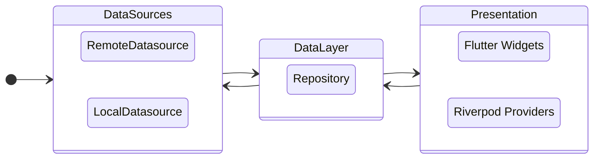

# App architecture

## General overview
This is a Flutter App which means a single code base for both mobile platforms Android and Ios
Flutter uses Dart as programming language

This app follows the principles of clean architecture which means it has separated layers each one with different purposes.

- **Data Sources layer:** as name states, here we handle the data sources (local and remote) here is where we make the calls to any external API
- **Domain Layer or Repository:** In this layer we abstract where the data comes from and provide it to the presentation layer
- **Presentation layer:** This layer is separated in two
    - UI layer which are the screens and Flutter Widgets
    - Cubits which are the ones responsible for handling the app's state. State management is handled using Bloc.

## Layer dissection

### Datasource layer
This layer is the one providing data. Data can come from a network source or a database
Network datasource uses [Dio](https://pub.dev/packages/dio)  as Http client.

Local data is stored using Shared Preferences or Secure Storage in case of sensitive data

### Data layer or Repository
This layer handles the abstraction between data origin and provides it to the presentation layer.

### Presentation Layer
For state handling app uses Riverpod as mentioned before. Riverpod is also used as Dependency Injector

For the UI layer, elements are divided in common reusable components used across different screens.
Components follow Atomic design principles.

